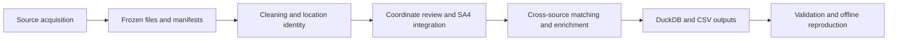

# NSW EV Charging Data Pipeline

A reproducible data engineering pipeline for electric vehicle charging infrastructure in New South Wales, Australia. It combines source acquisition, cleaning, cross-source matching, SA4 spatial integration and DuckDB storage, retaining evidence behind corrections and enrichment decisions.

This project grew out of **COMP5339 Data Engineering, Assignment 1, Semester 2 2026, at the University of Sydney**, developed by **TUT17-Group07**. Following submission, the repository is being organized as a continuing project. Version 0.1.2 includes canonical augmentation IDs, snapshot tools, automated tests and a reproducible release. Original record/location identities and the frozen source observations remain preserved. The submitted coursework archive is retained separately.

[](https://github.com/shuxiachai/nsw-ev-charging-data-pipeline/actions/workflows/tests.yml)

[Documentation](https://github.com/shuxiachai/nsw-ev-charging-data-pipeline/blob/main/docs/README.md) · [Architecture](https://github.com/shuxiachai/nsw-ev-charging-data-pipeline/blob/main/docs/architecture.md) · [Database schema](docs/schema.md) · [Data sources](docs/sources.md) · [Coursework origin](https://github.com/shuxiachai/nsw-ev-charging-data-pipeline/tree/main/docs/coursework)

## What it does

- Retrieves TfNSW charging records and ABS SA4 boundaries, with dated source files and SHA-256 manifests.
- Cleans addresses, operator names, postcodes and charger configurations while retaining original observations.
- Distinguishes source records from project locations and applies evidence-bound corrections and same-site reviews.
- Matches DC locations with Open Charge Map, OpenStreetMap, JOLT and Ampol observations, retaining conflicting attributes and rejected candidates.
- Stores relational and spatial results in DuckDB, with SQL constraints, audit tables and views for regional analysis.
- Checks data integrity and offline reproducibility against frozen inputs.

## Pipeline



## Validated coursework snapshot

These figures describe the frozen September 2026 project snapshot, not live charging availability.

| Measure | Result |
| --- | --- |
| Retained source records | 1,958 |
| Project locations | 1,936 |
| DC locations | 426 |
| NSW SA4 regions | 28 |
| DC locations with site attributes | 245 / 426 (57.51%) |
| DC locations with site information beyond identifiers and status | 214 / 426 (50.23%) |
| Database tables | 23 |
| Recorded tests / integrity checks | 1,006 / 47 |

Evidence: [tests](outputs/test_evidence.json), [validation](outputs/validation.json), [reproducibility](outputs/reproducibility.json). The table records the original coursework test count; the linked evidence reports the current release's full test count. Coverage measures completeness, not matching accuracy. Eight disputed points are excluded from distance-based analysis; reviewed locality evidence supports their regional assignments.

## Run the pipeline

**Requirements:** Python 3.12, the dependencies in `requirements.txt`, and the DuckDB spatial extension. Windows and Ubuntu/Linux execution have been verified. Initial dependency and extension installation requires internet access.

### Restore frozen inputs

A Git clone contains code, manifests, small source files and CSV results. Large original PDFs/ZIPs and the generated DuckDB database are delivered in the [v0.1.2 release](https://github.com/shuxiachai/nsw-ev-charging-data-pipeline/releases/tag/v0.1.2).

After cloning, `python scripts/restore_snapshot.py` validates the pinned release descriptor and raw inventory. Complete valid inputs skip downloading; otherwise the tool reuses a verified checksum-keyed cache or downloads the archive with an exclusive temporary file and restores only missing raw originals. It checks every body against the checkout's source manifest and preserves tracked code, manifests, CSVs and existing raw files. `python scripts/preflight.py` reports all remaining missing or corrupt inputs together.

You can instead download the complete versioned ZIP and checksum from the release, verify them, and work in its extracted project root. That archive includes code, frozen inputs, CSV results and DuckDB. Its release descriptor is published separately to avoid a self-referential archive checksum. Already-complete extracted archives can run preflight directly without restoration.

The 10 September Releases and the final submitted coursework ZIP are historical baselines. Use the version-matched public release for current reproduction.

### Install and run

```powershell
git clone https://github.com/shuxiachai/nsw-ev-charging-data-pipeline.git
cd nsw-ev-charging-data-pipeline
py -3.12 -m venv .venv
.\.venv\Scripts\python.exe -m pip install -r requirements.txt
.\.venv\Scripts\python.exe -m pip install -e . --no-deps
.\.venv\Scripts\python.exe scripts/restore_snapshot.py
.\.venv\Scripts\python.exe scripts/preflight.py
.\.venv\Scripts\python.exe -m ev_pipeline all
.\.venv\Scripts\python.exe scripts/verify_project.py
```

Run from the folder containing this README. If you already extracted a complete code/database archive, skip the clone, `cd` and `restore_snapshot.py` steps, then work in its project root and run preflight directly. If `py` is unavailable, use a Python 3.12 executable path. On Linux/macOS, use `python3.12 -m venv .venv` and `.venv/bin/python`; Ubuntu is covered by integration CI; macOS has not been verified.

`all` verifies cached inputs and can download missing sources. Restore the frozen snapshot first: some reviewed originals cannot be reacquired through a generic GET, and current publisher responses may differ. After inputs, dependencies and the extension are installed, `all --offline` rebuilds without downloading data. Editable installation adds the equivalent `nsw-ev-pipeline` command. This release supports execution from an editable checkout or complete extracted archive; a standalone wheel does not bundle the data snapshot.

| Command after the Python interpreter | Purpose |
| --- | --- |
| `scripts/preflight.py` | Check every raw source and manifest before building |
| `scripts/restore_snapshot.py` | Restore missing raw files from the pinned public release |
| `examples/demo.py` | Run the small synthetic DuckDB example |
| `-m ev_pipeline acquire` | Download missing sources and verify cached inputs |
| `-m ev_pipeline all --offline` | Rebuild from the verified local snapshot |
| `-m ev_pipeline validate` | Check database integrity and coverage |
| `scripts/verify_project.py` | Run tests, offline rebuild comparisons and database checks |
| `scripts/package_submission.py` | Build the legacy coursework ZIP after verification |

Do not run concurrent builds into the same output directory. `scripts/package_release.py` requires fresh schema-v2 full-suite evidence and bidirectional raw-source/manifest pairing before producing the public code/data archive including project documentation and examples. The legacy coursework packager retains its earlier file selection. The submitted coursework archive remains unchanged.

## Repository layout

```text
ev_pipeline/       Acquisition, cleaning, matching, spatial processing and storage
config/            Sources and evidence-bound review decisions
sql/               Database DDL and example analysis queries
scripts/           Verification, reproducibility and packaging tools
tests/             Unit, edge-case and database integration tests
data/raw/          Frozen inputs and manifests (partial in Git)
data/processed/    CSV results and local DuckDB database
outputs/           Quality reports, candidate decisions and verification evidence
docs/              Architecture, technical references and dated review records
docs/coursework/   Original assignment brief, rubric and project origin
```

Start with [pipeline.py](ev_pipeline/pipeline.py), [clean.py](ev_pipeline/clean.py), [augment.py](ev_pipeline/augment.py) and [schema.sql](sql/schema.sql). For SQL access without rebuilding, use the [standalone SQL guide](docs/standalone_sql.md).

## Data and interpretation limits

- The TfNSW file is named `ev_20251216.csv`, but its catalogue and documentation indicate April 2026. The observation period is unresolved; this is not a verified December 2025 inventory.
- Provider captures have different dates. Prices, network states and equipment descriptions are historical observations.
- A nearby point or matching operator alone does not establish a correct site match. Pending evidence and disagreements remain visible.
- Regional membership and charger-point accuracy are separate. Use `regional_analysis_locations` for reviewed SA4 counts and `analysis_ready_locations` for point-eligible analysis.

Read the [engineering design](docs/design.md), [source register](docs/sources.md), [current matching evidence](docs/matching_followup_20260913.md) and [technical guide](https://github.com/shuxiachai/nsw-ev-charging-data-pipeline/blob/main/docs/technical-guide.md) before interpreting the outputs.

## Contributors and AI assistance

The original project was jointly developed by **Jingbo Chai, Lyu Zhong, Chengsi Li and Sen Wang**. Jingbo coordinated integration; Lyu prepared the initial draft; Chengsi led reviews and database/report checks; Sen cross-checked source records and sites. These roles complement the group's shared work on methods and the report.

OpenAI Codex, ChatGPT and Claude Code assisted with development, reviews and writing. Generated or revised material was incorporated. Existing file-level acknowledgements are retained; automated checks do not establish independent ground truth. The coursework AI declaration was submitted separately.

## Reuse and next steps

Original project code and project-authored documentation use the [MIT license](LICENSE). The repository owner has confirmed publication authorization for the frozen data snapshot. Original publisher attributions and license metadata are retained in the [third-party notices](THIRD_PARTY_NOTICES.md) and [source register](docs/sources.md); MIT does not replace those publisher terms.

See [contribution guidance](CONTRIBUTING.md), [version history](CHANGELOG.md), [snapshot tools](docs/snapshot-tools.md) and the [synthetic example](examples/README.md). Windows/Linux CI runs focused regression tests; the full integration workflow verifies the complete snapshot. Further development can improve independently labelled matching evidence and support additional Python versions.

## Augmentation ID migration

v0.1.0 replaces legacy positional augmentation hashes with `a_v1_` IDs based on fixed named fields, normalized null/numeric values and the verified source snapshot SHA-256. Adding unrelated columns or changing pandas null representation no longer changes an observation's identity. All providers share one scheme. Existing external references to coursework augmentation IDs must be regenerated; original record and location ID rules are unchanged.

## Quick example

`python examples/demo.py` runs without the full data snapshot or spatial extension. The synthetic fixture demonstrates duplicate source records, distinct DC location counts, site versus operator scope, and retained connector disagreements.

## Release verification

v0.1.2 passes **1,239 full tests and 47 database checks**, including **127 new edge-case tests**, plus **317 fast tests on both Windows and Ubuntu**. [Full GitHub integration CI](https://github.com/shuxiachai/nsw-ev-charging-data-pipeline/actions/runs/36680141618) also passes. An independent public clone and fresh Python environment anonymously downloaded the release, restored 18 missing originals, reused the verified cache with network access disabled, rebuilt the database, and exactly matched the published signatures of 23 tables, 40 CSVs, schema, validation report and source fingerprint. See the [v0.1.2 verification record](docs/releases/v0.1.2-verification.json); the [v0.1.1 record](docs/releases/v0.1.1-verification.json) is retained.

## Verification and recovery boundaries

The full verifier isolates pytest selection and plugin settings, uses only the declared `tests/` fixture boundary, and records collection plus setup/call/teardown results. Release approval requires matching fresh report/JUnit artifacts, no deselected or skipped tests, and the unchanged source fingerprint; a selected passing subset cannot approve a public release.

Snapshot downloads use 60-second blocking-operation timeouts, checksum-qualified cache directories and per-invocation temporary files. Descriptor errors and transport failures produce a nonzero diagnostic. A failed download leaves previous cache data intact and cannot remove another invocation's temporary file. Raw originals without provenance manifests cannot enter the release.
