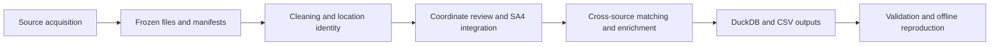

# NSW EV Charging Data Pipeline

A reproducible data engineering pipeline for electric vehicle charging infrastructure in New South Wales, Australia. It combines source acquisition, cleaning, cross-source matching, SA4 spatial integration and DuckDB storage, retaining evidence behind corrections and enrichment decisions.

This project grew out of **COMP5339 Data Engineering, Assignment 1, Semester 2 2026, at the University of Sydney**, developed by **TUT17-Group07**. Following submission, the repository is being organized as a continuing project. The current algorithms and validated data snapshot remain those of the coursework baseline; this documentation update introduces no new pipeline results.

[Documentation](https://github.com/shuxiachai/nsw-ev-charging-data-pipeline/blob/main/docs/README.md) · [Architecture](https://github.com/shuxiachai/nsw-ev-charging-data-pipeline/blob/main/docs/architecture.md) · [Database schema](docs/schema.md) · [Data sources](docs/sources.md) · [Coursework origin](https://github.com/shuxiachai/nsw-ev-charging-data-pipeline/tree/main/docs/coursework)

## What it does

- Retrieves TfNSW charging records and ABS SA4 boundaries, with dated source files and SHA-256 manifests.
- Cleans addresses, operator names, postcodes and charger configurations while retaining original observations.
- Distinguishes source records from project locations and applies evidence-bound corrections and same-site reviews.
- Matches DC locations with Open Charge Map, OpenStreetMap, JOLT and Ampol observations, retaining conflicting attributes and rejected candidates.
- Stores relational and spatial results in DuckDB, with SQL constraints, audit tables and views for regional analysis.
- Checks data integrity and offline reproducibility against frozen inputs.

## Pipeline



## Validated coursework snapshot

These figures describe the frozen September 2026 project snapshot, not live charging availability.

| Measure | Result |
| --- | --- |
| Retained source records | 1,958 |
| Project locations | 1,936 |
| DC locations | 426 |
| NSW SA4 regions | 28 |
| DC locations with site attributes | 245 / 426 (57.51%) |
| DC locations with site information beyond identifiers and status | 214 / 426 (50.23%) |
| Database tables | 23 |
| Recorded tests / integrity checks | 1,006 / 47 |

Evidence: [tests](outputs/test_evidence.json), [validation](outputs/validation.json), [reproducibility](outputs/reproducibility.json). Coverage measures completeness, not matching accuracy. Eight disputed points are excluded from distance-based analysis; reviewed locality evidence supports their regional assignments.

## Run the pipeline

**Requirements:** Python 3.12, the dependencies in `requirements.txt`, and the DuckDB spatial extension. Windows execution has been verified. Initial dependency and extension installation requires internet access.

### Restore frozen inputs

A Git clone contains code, manifests, small source files and CSV results. Large source PDFs/ZIPs and the generated DuckDB database are excluded from Git.

For the coursework baseline, obtain the ZIP and checksum from the [reviewed 10 September snapshot](https://github.com/shuxiachai/nsw-ev-charging-data-pipeline/releases/tag/review-fixes-2026-09-10). Verify the checksum, extract the archive separately, and restore its frozen `data/` files into the checkout. Preserve the checkout's tracked files, including manifests and processed CSVs; source and manifest hashes must agree. The pipeline stops on incompatible inputs. That Release contains historical code and is not the final submitted code version. Release access follows repository permissions.

The final submitted archive was retained separately on 25 September 2026. See [coursework provenance](https://github.com/shuxiachai/nsw-ev-charging-data-pipeline/tree/main/docs/coursework) for its identifier. Future changes to pinned inputs require a matching data snapshot.

### Install and run

```powershell
git clone https://github.com/shuxiachai/nsw-ev-charging-data-pipeline.git
cd nsw-ev-charging-data-pipeline
py -3.12 -m venv .venv
.\.venv\Scripts\python.exe -m pip install -r requirements.txt
# Restore the verified data/ snapshot before the next command.
.\.venv\Scripts\python.exe -m ev_pipeline all
.\.venv\Scripts\python.exe scripts/verify_project.py
```

Run from the folder containing this README. If you already extracted a complete code/database archive, skip the clone and `cd` steps and work in its project root. If `py` is unavailable, use a Python 3.12 executable path. On Linux/macOS, use `python3.12 -m venv .venv` and `.venv/bin/python`; those platforms have not been verified for this project.

`all` verifies cached inputs and can download missing sources. Restore the frozen snapshot first: some reviewed originals cannot be reacquired through a generic GET, and current publisher responses may differ. After inputs, dependencies and the extension are installed, `all --offline` rebuilds without downloading data.

| Command after the Python interpreter | Purpose |
| --- | --- |
| `-m ev_pipeline acquire` | Download missing sources and verify cached inputs |
| `-m ev_pipeline all --offline` | Rebuild from the verified local snapshot |
| `-m ev_pipeline validate` | Check database integrity and coverage |
| `scripts/verify_project.py` | Run tests, offline rebuild comparisons and database checks |
| `scripts/package_submission.py` | Build the legacy coursework ZIP after verification |

Do not run concurrent builds into the same output directory. The legacy packager retains its coursework file selection; new repository navigation and course-reference pages are not included in its ZIP. The submitted archive is unchanged by this reorganization.

## Repository layout

```text
ev_pipeline/       Acquisition, cleaning, matching, spatial processing and storage
config/            Sources and evidence-bound review decisions
sql/               Database DDL and example analysis queries
scripts/           Verification, reproducibility and packaging tools
tests/             Unit, edge-case and database integration tests
data/raw/          Frozen inputs and manifests (partial in Git)
data/processed/    CSV results and local DuckDB database
outputs/           Quality reports, candidate decisions and verification evidence
docs/              Architecture, technical references and dated review records
docs/coursework/   Original assignment brief, rubric and project origin
```

Start with [pipeline.py](ev_pipeline/pipeline.py), [clean.py](ev_pipeline/clean.py), [augment.py](ev_pipeline/augment.py) and [schema.sql](sql/schema.sql). For SQL access without rebuilding, use the [standalone SQL guide](docs/standalone_sql.md).

## Data and interpretation limits

- The TfNSW file is named `ev_20251216.csv`, but its catalogue and documentation indicate April 2026. The observation period is unresolved; this is not a verified December 2025 inventory.
- Provider captures have different dates. Prices, network states and equipment descriptions are historical observations.
- A nearby point or matching operator alone does not establish a correct site match. Pending evidence and disagreements remain visible.
- Regional membership and charger-point accuracy are separate. Use `regional_analysis_locations` for reviewed SA4 counts and `analysis_ready_locations` for point-eligible analysis.

Read the [engineering design](docs/design.md), [source register](docs/sources.md), [current matching evidence](docs/matching_followup_20260913.md) and [technical guide](https://github.com/shuxiachai/nsw-ev-charging-data-pipeline/blob/main/docs/technical-guide.md) before interpreting the outputs.

## Contributors and AI assistance

The original project was jointly developed by **Jingbo Chai, Lyu Zhong, Chengsi Li and Sen Wang**. Jingbo coordinated integration; Lyu prepared the initial draft; Chengsi led reviews and database/report checks; Sen cross-checked source records and sites. These roles complement the group's shared work on methods and the report.

OpenAI Codex, ChatGPT and Claude Code assisted with development, reviews and writing. Generated or revised material was incorporated. Existing file-level acknowledgements are retained; automated checks do not establish independent ground truth. The coursework AI declaration was submitted separately.

## Reuse and next steps

No project-wide code license has been selected yet. Third-party data, operator publications and University teaching materials retain their respective rights and terms; their presence here does not grant a new reuse license. Consult the [source register](docs/sources.md) for source-specific notes.

Planned next steps are to establish code licensing with contributors, document redistribution terms for a reusable data release, verify additional platforms, and improve inspection of unresolved matches. These are future work, not implemented features.
