# Schema diagram

The authoritative executable definition is `sql/schema.sql`. All stored geometry
uses EPSG:4326. The diagram shows primary relationships; column-level checks and
source-scope exclusivity are specified in the DDL.

```mermaid
erDiagram
    operator ||--o{ location : operates
    region o|--o{ location : contains
    location ||--|{ charger_record : has_source_records
    charger_record ||--o{ quality_issue : has_diagnostics
    charger_record ||--o| source_resolution : resolves_conflict
    charger_record ||--o| reviewed_resolution : records_reviewed_correction
    charger_record ||--o| reviewed_region : records_regional_membership
    location ||--o| reviewed_region : retains_uncertain_point
    region ||--o{ reviewed_region : supplies_point_and_reviewed_sa4
    reviewed_region ||--|{ reviewed_region_evidence : documents_inference
    source_snapshot ||--o{ reviewed_region_evidence : supplies_pinned_original
    charger_record ||--o| reviewed_identity : records_reviewed_membership
    location ||--o{ reviewed_identity : receives_reviewed_members
    source_snapshot ||--o{ reviewed_identity : preserves_original_values
    source_snapshot ||--o{ reviewed_identity_evidence : supplies_operator_identity_evidence
    external_site o|--o{ source_resolution : address_evidence
    osm_site o|--o{ source_resolution : corroborates_position
    source_snapshot o|--o{ source_resolution : ocm_original
    source_snapshot ||--o{ reviewed_resolution : supplies_required_and_supporting_evidence
    location ||--o{ augmentation : has_observations
    source_snapshot ||--o{ augmentation : supports
    source_snapshot ||--o{ external_site : supplies
    source_snapshot ||--o{ osm_site : supplies
    source_snapshot ||--o{ jolt_site : supplies
    source_snapshot ||--o{ amp_charge_site : supplies
    external_site ||--o{ external_connector : has
    location ||--o| site_match : matches_ocm
    external_site ||--o| site_match : matched_by
    source_snapshot o|--o{ site_match : supports_address_exception
    charger_record ||--o{ reviewed_match_exclusion : identifies_withheld_pair
    location ||--o{ reviewed_match_exclusion : withholds_ocm_association
    external_site ||--o{ reviewed_match_exclusion : preserves_unmatched_observation
    source_snapshot ||--o{ reviewed_match_exclusion : supports_withholding
    location ||--o| osm_site_match : matches_osm
    osm_site ||--o| osm_site_match : matched_by
    location ||--o| jolt_site_match : matches_jolt
    jolt_site ||--o| jolt_site_match : matched_by
    location ||--o| amp_charge_site_match : matches_ampol
    amp_charge_site ||--o| amp_charge_site_match : matched_by
    external_site o|--o{ augmentation : site_evidence
    osm_site o|--o{ augmentation : site_evidence
    jolt_site o|--o{ augmentation : site_evidence
    amp_charge_site o|--o{ augmentation : site_evidence
```

Operator lookup observations retain the original OCM operator ID and lookup-file
path. Operator homepages/network-map links found in matched site records retain
their OCM/OSM site foreign key and source-file path, while using operator scope.
The DDL allows only the specifically named link attributes for this latter case.
Site-scope attributes have exactly one source-site foreign key. Every observation
with a source-site key, including operator links, requires an accepted match.

`external_connector` preserves the source's quantity, status ID, status label and
`is_operational` classification. The last field is not live availability. A zero
quantity stays in this table but does not contribute to the reported connector
type list. Separate quality CSVs identify zero quantities and differing site/
connection labels. `external_site.last_verified_at` is a parsed UTC view of the
retained `last_verified` source string, not a price-effective or retrieval time.

`jolt_site.network_status_snapshot` and `evse_status_snapshot` retain nullable
reported states from the archived operator map. They have separate allowed-value
checks and produce the corresponding `operator_network_status_snapshot` and
`operator_evse_status_snapshot` observations only for accepted JOLT matches.
Independent validation compares the site values against the raw map, then checks
the complete attribute values, source links and accepted identities. Their
`source_snapshot.retrieved_at_utc` is a response capture time, not an underlying
measurement time or a claim of current availability. The legacy `status_snapshot`
field supplies no defaults for either field.

`jolt_site.carpark_hours_text` retains an explicit parking-hours line from the
map address. The corresponding `operator_carpark_hours_text` site observation
does not invent weekdays or unrestricted charger access. The raw-map validator
also checks these values and their complete accepted-match/source relationships.

`amp_charge_site` retains the publisher's original station ID/GUID, address,
coordinates and complete per-location `EVCharging` service JSON. Only explicit
connector-type statements become `dc_connector_types`. Service labels such as
Bay 01/02 do not establish a complete equipment count; powers in their original
text are not substituted for TfNSW ratings. A page without the service category
remains observable with `has_dc=false`, which means insufficient published
AmpCharge evidence rather than proof of no physical charger. Matches use the
same conservative thresholds and external-site reuse policy. Three independent
checks reconstruct the site/source rows, matches and complete attributes from
pinned originals, including the negative observation. `augmentation.ampol_id`
joins to exactly one provider site and is only permitted for site scope.

`charger_record.source_row` is unique. Power bounds must both be null or both
finite and positive with minimum no greater than maximum. External connector
power is nullable, finite and nonnegative. Source digests must be 64 lowercase
hexadecimal characters. Independent validation checks these invariants as well
as exact `location_power_observations` membership. This view exposes each
available charger-record rating, original text and provenance without summing
ratings or silently filling the location representative's missing fields.

`reviewed_identity` retains each reviewed source row, old/new location ID, fixed
representative record, reason, date and source snapshot. It preserves both
observations instead of adding their plug counts. SQL validation verifies member
links and the representative's unchanged original point. `site_match` has paired
nullable address-exception review/source columns; the source is a foreign key to
`source_snapshot`. Full exception guards and the attributed rendered-page excerpt
are preserved in configuration and matching audit exports. OCM point/connector
counts allow null or zero, reject negatives in DDL, and are validated for integral,
finite, non-Boolean values before insertion to prevent integer-cast rounding.

`reviewed_identity_evidence` identifies the operator map/detail sources, roles,
element IDs and hashes for the three Exploren groups and the Campbelltown/Mount
Annan, Cowell Street and Parraween Street venue groups. Its composite primary
key is `(review_id,source_file,role)` and its source-file key references
`source_snapshot`. Independent validation requires the complete configured
evidence set, matching source hashes and an existing reviewed identity group.

`reviewed_match_exclusion` records an individually reviewed, withheld OCM
association without deleting the source charger or the external observation.
The complete source values and four pinned source/evidence files bind the review
to its particular record and OCM ID. Validation requires the complete review
ledger and ensures that neither the accepted OCM match nor its site attributes
survive. Independently accepted JOLT/OSM observations and operator details remain
eligible. The decision is pending location evidence, not a proved wrong match.

`reviewed_resolution` is a separate audit of individually reviewed corrections.
Its `record_id` is both a primary key and a foreign key to `charger_record`.
The three required source-file relationships summarized in the diagram are:

| Foreign-key column | Referenced column | Evidence role |
| --- | --- | --- |
| `coordinate_source_file` | `source_snapshot.source_file` | Original containing the selected coordinate; identified by `coordinate_element_id` |
| `corroborating_source_file` | `source_snapshot.source_file` | Separate published map original; identified by `corroborating_element_id` |
| `address_source_file` | `source_snapshot.source_file` | Archived council or operator document supporting the source address/venue |
| `supporting_address_source_file` (optional) | `source_snapshot.source_file` | Second address/venue original for a cross-document review, with a required paired `supporting_address_locator` |

Wagga uses the main PDF to link address variants to the same land parcels and
car park; the second council HTML records the existing NRMA installation there.
Both source relationships and hashes are checked against the reviewed
configuration, including detection of both optional columns being cleared.

The table retains old/new coordinates and postcodes, review reason, fixed review
date, the distance between the selected point and corroborating feature, and the size of the source
coordinate change. Constraints require a resolved decision, valid new coordinate
ranges, a corroboration distance from 0 to 150 m, and a non-negative change
distance. SQL validation also checks that each applied correction agrees with
the final location and that the location's stored point equals its longitude and
latitude.

`corroborating_role` is required and restricted to `same_operator_charger` or
`mapped_landmark`. It is independently compared with the configured source kind.
Walcha uses the latter: the feature is a mapped police building, not a second
charger; its additional road-corridor and direction checks are implemented in
the reviewed stage. Wollongong uses OCM/KML operator points. Wagga, Wollongong
and Walcha each require the optional second address source and locator.

`source_resolution` retains the earlier automatic decision even when the same
record is subsequently corrected in `reviewed_resolution`. Thus an automatic
`unresolved` result and a later reviewed `resolved` result can coexist without
conflicting provenance. Final remaining conflicts are counted from the final
records/locations. The reviewed configuration additionally pins the NRMA webpage
that publishes the corroborating map; this publication relationship is kept in
configuration and raw evidence rather than fabricated as an external-site match.

Spatial method/distance combinations and resolved-coordinate/postcode fields also have explicit CHECK constraints. SQL validation checks exact view membership and computes DC coverage from base records. Persisted table, view and index definitions are included in offline-rebuild and packaging signatures.

`reviewed_region` is separate from `reviewed_resolution`: a regional review does
not replace charger coordinates or remove coordinate conflict. Its record and
location keys are unique; original-point and reviewed SA4 codes both reference
`region`. `locality_geometry` is the entire official locality in EPSG:4326,
including every ring, and must not be interpreted as the charger footprint.
Method is `official_locality_containment` and coordinate status is `unresolved`.
The evidence table has composite key `(review_id,source_file,role)` and stores
the original-file foreign key, locator and SHA-256. Validation compares the full
evidence set, raw bytes/metadata and complete persisted locality WKB with the
review configuration, then independently requires whole-polygon containment.

`regional_analysis_locations` exposes the reviewed regional assignment and
separately labelled `source_point_sa4_code`. It includes ordinary analysis-ready
locations and independently reviewed regional records, without point geometry
or longitude/latitude. Exact view membership, assignments and coordinate status
are validated. The existing `analysis_ready_locations` remains suitable for
point use under its documented limits and excludes all eight identified source conflicts.
